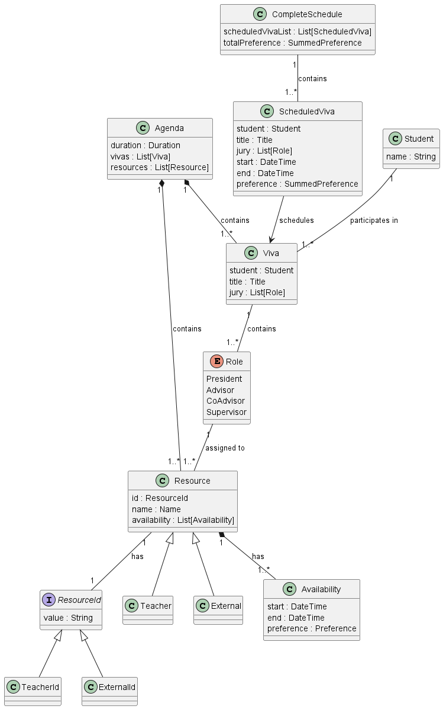
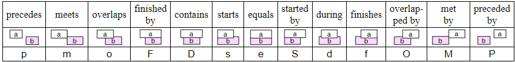
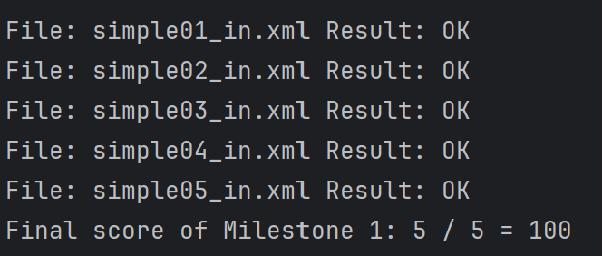
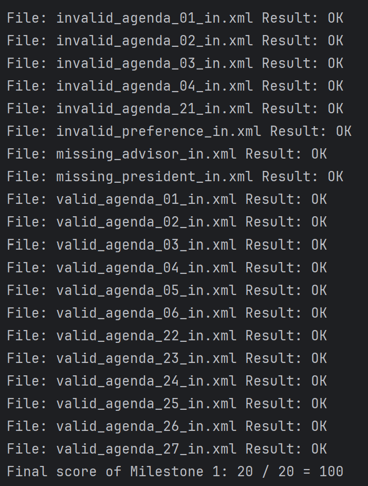

# Executive Report

## Project Overview
The project involves the scheduling of MsC dissertation defenses, also known as viva. The objective of the project is to create a scheduling system that can efficiently allocate time slots for viva based on various constraints and restrictions.

The significance of this project lies in its ability to streamline the scheduling process for MsC dissertation defenses. By automating the scheduling process, it can save time and effort for the entities involved, such as the students, teachers and externals. It can also help ensure that viva are scheduled at the most favorable times, taking into account the availability and preferences of the participants. Additionally, by considering the scheduling restrictions and the potential overlap of entities across different viva, the system can optimize the allocation of time slots and minimize conflicts.

Overall, the project aims to improve the efficiency and effectiveness of scheduling MsC dissertation defenses, making the process smoother and more convenient for all parties involved.

## Domain Model

The domain model for the Viva scheduling system is designed around the concept of roles and their operations. The key entities in this model are:



### Viva
A Viva instance represents an individual dissertation defense session. It contains information about the student presenting their dissertation, the title of the dissertation, and the members of the jury who will evaluate the defense. The jury members are represented by a list of Role instances.

### Role
The Role enum defines the different roles that individuals can have during a dissertation defense. These roles include:

- **President:** Typically the head of the examination panel.
- **Advisor:** The academic advisor who has guided the student throughout their dissertation.
- **CoAdvisor:** An additional advisor who may have provided support during the dissertation process.
- **Supervisor:** A supervisory role overseeing the dissertation defense process.
Each role has an associated resource, which could be a teacher or an external examiner.

### ResourceId
The ResourceId trait serves as the identifier for resources associated with roles. It is a common interface implemented by specific resource identifiers, such as TeacherId and ExternalId. These identifiers uniquely identify resources within the scheduling system.

### Resource
The Resource trait represents the resources available for scheduling dissertation defenses. It includes information such as the resource identifier (ResourceId), the name of the resource (e.g., the name of a teacher or an external examiner), and the availability of the resource for scheduling (Availability). Resources are categorized into subclasses Teacher and External, depending on whether they are internal faculty members or external examiners.

### Availability
The Availability class represents the availability of resources for scheduling dissertation defenses. It contains details such as the start and end times during which the resource is available and the preference level associated with scheduling the resource for a particular defense. This allows the scheduling system to optimize the allocation of resources based on their availability and preferences.

### ScheduledViva
A ScheduledViva instance represents a dissertation defense session that has been scheduled within the agenda. It includes details such as the student presenting their dissertation, the title of the dissertation, the members of the jury, the start and end times of the defense session, and the preference level associated with scheduling the defense.

### CompleteSchedule
The CompleteSchedule class encapsulates the entire schedule of dissertation defenses, including all scheduled defense sessions (ScheduledViva instances) and the total preference level for the entire schedule. It provides a comprehensive view of the scheduled defenses and their associated preferences, allowing stakeholders to assess the overall scheduling efficiency and effectiveness.

## Key Decisions & Justifications

This log lists the architectural decisions for MS01.

* [ADR-0001](decisions/0001-viva-model-use-role-list.md) - Should viva use as attribute, a set of roles or president and advisor roles?
* [ADR-0002](decisions/0002-role-operations-use-module.md) - Should role operations be a companion object or module?
* [ADR-0003](decisions/0003-role-model-use-resource-reference.md) - Should role model use object reference or id?
* [ADR-0004](decisions/0004-role-model-use-enum.md) - Should we use enum or sealed trait for roles?

## Challenges & Solutions

During the project, we encountered several challenges that required careful consideration and problem-solving. Here are some of the key challenges and their corresponding solutions:

### 1. Allen's Interval Algebra
Allen's Interval Algebra is a mathematical framework used to reason about and manipulate intervals of time. It provides a set of rules and operations that allow us to perform various operations on intervals, such as determining their intersection, checking if one interval is contained within another, and more.



In our project, Allen's Interval Algebra was a crucial tool for solving the challenge of determining the intersection of availabilities for scheduling dissertation defenses. By applying the principles of Allen's Interval Algebra, we were able to identify common time slots where all required resources were available. This helped us streamline the scheduling process and ensure that all necessary resources were allocated efficiently.

#### intersectable

```scala
def intersectable(a: Availability, b: Availability, duration: Duration): Boolean =
    overlaps(a,b)    || overlaps(b, a)  ||
    finishedBy(a, b) || finishedBy(b,a) ||
    contains(a, b)   || contains(b, a)  ||
    starts(a, b)     || starts(b, a)    ||
    equals(a, b)
```

This method takes two `Availability` objects and a `Duration`. It checks if the two availabilities intersect and if the intersection is long enough to accommodate the given duration. It returns `true` if they do, `false` otherwise.

This method is associated with the "overlaps", "finishedBy", "contains", "starts" and "equals" relations, as it involves checking if one interval starts before and finishes after the start of another interval.

### 2. Scheduling a Viva
One of the challenges we faced was determining the intersection of availabilities for scheduling dissertation defenses. This involved finding common time slots where all required resources were available. We addressed this challenge by implementing an algorithm that checks the availability of each resource and identifies the overlapping time slots.

The `ScheduleOperation` object in the `pj.domain` package contains several methods related to scheduling a viva. Here's a brief explanation of each method:

#### getFirstAvailability

```scala
def getFirstAvailability(availabilities: List[Availability]): Result[Availability]
```

This method takes a list of `Availability` objects and returns the first availability in the list. The availabilities are sorted by their start time. If there are no availabilities, it returns a `Left` with `NoAvailableSlot`.

#### getAvailabilitiesForVivas

```scala
def getAvailabilitiesForVivas(viva: Viva, resources: List[Resource], duration: Duration): Result[List[List[Availability]]]
```

This method takes a `Viva` object, a list of `Resource` objects, and a `Duration`. It filters the resources that match the jury members of the viva and retrieves their availabilities. It then filters these availabilities to only include those that are long enough to accommodate the viva's duration. If there are no matching availabilities, it returns a `Left` with `NoAvailableSlot`.

#### scheduleVivaFromViva

```scala
def scheduleVivaFromViva(viva: Viva, resources: List[Resource], originalResources: List[Resource], duration: Duration): Result[(ScheduledViva, List[Resource])]
```

This method takes a `Viva` object, a list of `Resource` objects, another list of original `Resource` objects, and a `Duration`. It attempts to schedule the viva by finding a suitable availability slot among the resources. If successful, it returns a `Right` with a tuple containing the scheduled viva and the updated list of resources. If unsuccessful, it returns a `Left` with an error.

#### innerScheduleVivaFromAgenda

```scala
def innerScheduleVivaFromAgenda(agenda: Agenda, resources: List[Resource]): Result[List[ScheduledViva]]
```

This method takes an `Agenda` object and a list of `Resource` objects. It attempts to schedule all the vivas in the agenda by calling `scheduleVivaFromViva` for each viva. If all vivas are successfully scheduled, it returns a `Right` with a list of scheduled vivas. If any viva cannot be scheduled, it returns a `Left` with an error.

#### scheduleVivaFromAgenda

```scala
def scheduleVivaFromAgenda(agenda: Agenda): Result[List[ScheduledViva]]
```

This method takes an `Agenda` object. It calls `innerScheduleVivaFromAgenda` to schedule all the vivas in the agenda. The scheduled vivas are then sorted by their start time. If all vivas are successfully scheduled, it returns a `Right` with the sorted list of scheduled vivas. If any viva cannot be scheduled, it returns a `Left` with an error.

#### durationOfIntersectionIsEqualOrMoreThanDuration

```scala
def durationOfIntersectionIsEqualOrMoreThanDuration(a: Availability, b: Availability, duration: Duration): Boolean
```

This method takes two `Availability` objects and a `Duration`. It checks if the intersection of the two availabilities is equal to or longer than the given duration. It returns `true` if it is, `false` otherwise.

#### intersection

```scala
def intersection(a: Availability, b: Availability, duration: Duration): Availability
```

This method takes two `Availability` objects and a `Duration`. It returns the intersection of the two availabilities if they intersect and the intersection is long enough to accommodate the given duration.

#### intersectAvailabilityWithList

```scala
def intersectAvailabilityWithList(availability: Availability, list: List[Availability], duration: Duration): Option[Availability]
```

This method takes an `Availability` object, a list of `Availability` objects, and a `Duration`. It checks if the given availability intersects with any availability in the list and if the intersection is long enough to accommodate the given duration. If it does, it returns the intersection. If it doesn't, it returns `None`.

#### intersectList

```scala
def intersectList(a: List[Availability], b: List[Availability], duration: Duration): List[Availability]
```

This method takes two lists of `Availability` objects and a `Duration`. It returns a list of all availabilities in the first list that intersect with any availability in the second list and where the intersection is long enough to accommodate the given duration.

#### intersectAll

```scala
def intersectAll(a: List[List[Availability]], duration: Duration): List[Availability]
```

This method takes a list of lists of `Availability` objects and a `Duration`. It returns a list of all availabilities in the first list of each sublist that intersect with any availability in the second list of each sublist and where the intersection is long enough to accommodate the given duration.

### 3. Updating Resources
Updating the availability of resources posed a challenge, as it required ensuring data consistency and avoiding conflicts with already scheduled defenses. We addressed this challenge by implementing a mechanism that checks for conflicts when updating resource availabilities and adjusts the schedule accordingly.

The `AvailabilityOperations` object in the `pj.domain` package contains several methods related to managing and manipulating availabilities. Here's a brief explanation of each method:

#### updateAvailability

```scala
def updateAvailability(resources: List[Resource], start: DateTime, end: DateTime): Result[Resource]
```

This method takes a list of `Resource` objects and a start and end `DateTime`. It updates the availability of the resources that have an availability slot that matches the given start and end time. If no such resource is found, it returns a `Left` with `NoResourcesFound`.

#### updateAllAvailabilities

```scala
def updateAllAvailabilities(resources: List[Resource], viva: Viva, start: DateTime, end: DateTime): Result[List[Resource]]
```

This method takes a list of `Resource` objects, a `Viva` object, and a start and end `DateTime`. It updates the availability of all resources that are part of the viva's jury and have an availability slot that matches the given start and end time. If any resource cannot be updated, it returns a `Left` with an error.

#### updateAvailability

```scala
def updateAvailability(resource: Resource, start: DateTime, end: DateTime): Result[Resource]
```

This method takes a `Resource` object and a start and end `DateTime`. It updates the availability of the resource by removing the interval between the start and end time from the resource's availability. It returns the updated resource.

#### removeInterval

```scala
def removeInterval(availability: Availability, start: DateTime, end: DateTime): List[Availability]
```

This method takes an `Availability` object and a start and end `DateTime`. It removes the interval between the start and end time from the availability. It returns the updated availability.

### 4. Calculating Preferences
Calculating preferences for dissertation defenses was another challenge we encountered. We needed to consider the preferences of both the jury members and the students when scheduling the vivas. To address this challenge, we implemented a function that takes a `Viva` object and a list of `Resource` objects as input and returns a list of `Preference` objects.

The `PreferencesCalculation` object in the `pj.domain` package contains several methods related to calculating preferences for scheduling a viva. Here's a brief explanation of each method:

#### sumPreferences

```scala
def sumPreferences(list: List[Preference]): Result[SummedPreference]
```

This method takes a list of `Preference` objects and returns the sum of all preferences in the list. If the sum is greater than or equal to 1, it returns a `SummedPreference`. Otherwise, it returns an `InvalidPreference` error.

#### sumSummedPreferences

```scala
def sumSummedPreferences(list: List[SummedPreference]): Result[SummedPreference]
```

This method takes a list of `SummedPreference` objects and returns the sum of all summed preferences in the list. If the sum is greater than or equal to 1, it returns a `SummedPreference`. Otherwise, it returns an `InvalidPreference` error.

#### sumPreferencesOfScheduledVivas

```scala
def sumPreferencesOfScheduledVivas(scheduledVivas: List[ScheduledViva]): Result[SummedPreference]
```

This method takes a list of `ScheduledViva` objects and returns the sum of all preferences of the scheduled vivas. It does this by mapping each scheduled viva to its preference and then calling `sumSummedPreferences` on the resulting list of summed preferences.

#### calculatePreferences

```scala
def calculatePreferences(resources: List[Resource], viva: Viva, startTime: DateTime, endTime: DateTime): Result[SummedPreference]
```

This method takes a list of `Resource` objects, a `Viva` object, and a start and end `DateTime`. It calculates the sum of the preferences of all resources that are part of the viva's jury and have an availability slot that overlaps with the given start and end time. It does this by filtering the resources, retrieving their preferences, and then calling `sumPreferences` on the resulting list of preferences.

#### calculatePreferenceValuesByStudent

```scala
def calculatePreferenceValuesByStudent(agenda: Agenda, student: Student, startTime: DateTime, endTime: DateTime): Result[SummedPreference]
```

This method takes an `Agenda` object, a `Student` object, and a start and end `DateTime`. It calculates the sum of the preferences of all vivas in the agenda that the student is part of and that have a start and end time that overlaps with the given start and end time. It does this by filtering the vivas, retrieving their preferences, and then calling `sumPreferences` on the resulting list of preferences.

#### calculatePreferences

```scala
def calculatePreferences(agenda: Agenda, students: List[Student], startTime: DateTime, endTime: DateTime): Result[List[SummedPreference]]
```

This method takes an `Agenda` object, a list of `Student` objects, and a start and end `DateTime`. It calculates the sum of the preferences of all vivas in the agenda that each student is part of and that have a start and end time that overlaps with the given start and end time. It does this by looping over the students, calling `calculatePreferenceValuesByStudent` for each student, and then aggregating the results into a list of summed preferences.

## Tests

The project includes a comprehensive suite of tests to ensure the correctness and reliability of the scheduling system. The tests cover various scenarios and edge cases to validate the behavior of the scheduling algorithms and functions. The tests are organized into different categories based on the functionality they test.

### Domain Tests

The domain tests validate the core domain entities and operations, such as viva, role, resource, and availability. They ensure that the domain model is correctly implemented and that the entities behave as expected.

1. **Viva Tests**: These tests would validate the creation and manipulation of viva instances. This could involve creating viva objects with different attributes, updating viva attributes, and verifying that the viva objects are correctly constructed.

2. **Role Tests**: These tests would validate the creation and manipulation of role instances. This could involve creating role objects with different attributes, updating role attributes, and verifying that the role objects are correctly constructed.

3. **Resource Tests**: These tests would validate the creation and manipulation of resource instances. This could involve creating resource objects with different attributes, updating resource attributes, and verifying that the resource objects are correctly constructed.

4. **Availability Tests**: These tests would validate the creation and manipulation of availability instances. This could involve creating availability objects with different attributes, updating availability attributes, and verifying that the availability objects are correctly constructed.

5. **Scheduled Viva Tests**: These tests would validate the creation and manipulation of scheduled viva instances. This could involve creating scheduled viva objects with different attributes, updating scheduled viva attributes, and verifying that the scheduled viva objects are correctly constructed.

6. **Complete Schedule Tests**: These tests would validate the creation and manipulation of complete schedule instances. This could involve creating complete schedule objects with different attributes, updating complete schedule attributes, and verifying that the complete schedule objects are correctly constructed.

7. **Teacher Tests**: These tests would validate the creation and manipulation of teacher instances. This could involve creating teacher objects with different attributes, updating teacher attributes, and verifying that the teacher objects are correctly constructed.


### SimpleType Tests

The simple type tests validate the simple types used in the domain model, such as `DateTime` and `Duration`. They ensure that these simple types are correctly implemented and behave as expected.

1. **DateTime Tests**: These tests would validate the creation and manipulation of `DateTime` instances. This could involve creating `DateTime` objects with different attributes, updating `DateTime` attributes, and verifying that the `DateTime` objects are correctly constructed.

2. **Duration Tests**: These tests would validate the creation and manipulation of `Duration` instances. This could involve creating `Duration` objects with different attributes, updating `Duration` attributes, and verifying that the `Duration` objects are correctly constructed.

3. **Preference Tests**: These tests would validate the creation and manipulation of `Preference` instances. This could involve creating `Preference` objects with different attributes, updating `Preference` attributes, and verifying that the `Preference` objects are correctly constructed.

4. **Summed Preference Tests**: These tests would validate the creation and manipulation of `SummedPreference` instances. This could involve creating `SummedPreference` objects with different attributes, updating `SummedPreference` attributes, and verifying that the `SummedPreference` objects are correctly constructed.

5. **Student Tests**: These tests would validate the creation and manipulation of `Student` instances. This could involve creating `Student` objects with different attributes, updating `Student` attributes, and verifying that the `Student` objects are correctly constructed.

6. **Title Tests**: These tests would validate the creation and manipulation of `Title` instances. This could involve creating `Title` objects with different attributes, updating `Title` attributes, and verifying that the `Title` objects are correctly constructed.

7. **Name Tests**: These tests would validate the creation and manipulation of `Name` instances. This could involve creating `Name` objects with different attributes, updating `Name` attributes, and verifying that the `Name` objects are correctly constructed.


### Operations Tests

The operations tests validate the scheduling operations, such as scheduling a viva, updating resource availabilities, and calculating preferences. They test the scheduling algorithms and functions to ensure that they allocate time slots correctly and handle various constraints and restrictions.

1. **Scheduling a Viva**: These tests would validate that the system can correctly schedule a viva. This could involve creating a viva with specific resources and availabilities, running the scheduling operation, and then verifying that the viva has been scheduled at the correct time with the correct resources.  

2. **Updating Resource Availabilities**: These tests would check that the system can correctly update the availability of resources. This could involve creating a resource with a specific availability, running the update operation with a new availability, and then verifying that the resource's availability has been updated correctly.  

3. **Calculating Preferences**: These tests would validate that the system can correctly calculate preferences for scheduling a viva. This could involve creating a viva with specific resources and preferences, running the preference calculation operation, and then verifying that the calculated preferences match the expected values.

### Functional Tests

These tests validate the overall functionality of the scheduling system by testing the integration of various components and operations. They ensure that the system behaves as expected.

These tests utilize files of input and output created to validate the that the system is working correctly.

By running the tests in the file `ScheduleMS01Test` it shows the tests that pass.



### Assessment Tests

This are tests given by the professor to assess the correctness of the scheduling system. It was given input files for us to tests the scheduling system and then compare to the given output files.

By running the tests in `AssessmentTestMS01` we can verify that they all pass, assuring that the scheduling system is working fine.



## Future Improvements

Here are some potential improvements and next steps for the project:

1. **Optimization Algorithms:** Implement optimization algorithms to improve the allocation of time slots for viva. This could involve considering additional constraints, such as preferences.


## Conclusion
The project has developed a scheduling system for MsC dissertation defenses, streamlining the process and saving time and effort for all stakeholders involved. By automating the scheduling process and considering various constraints and restrictions, the system optimizes the allocation of time slots and minimizes conflicts. This improves the efficiency and effectiveness of scheduling dissertation defenses, making the process smoother and more convenient. 